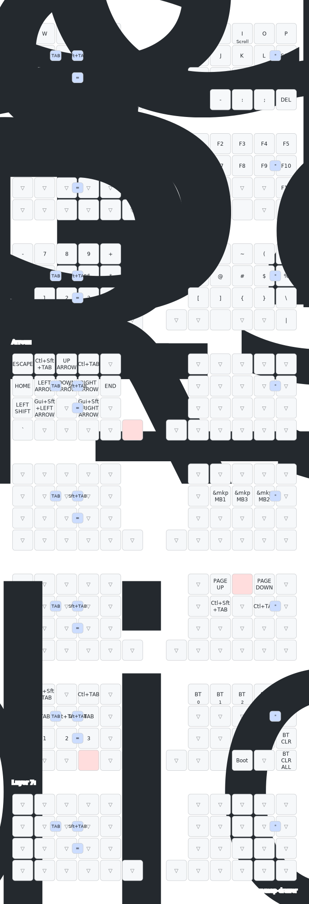

# LisM キーボード ファームウェア

[](https://opensource.org/licenses/MIT)



自作キーボード LisMのファームウェアです。  
DYA Studio対応版は[dya-studio_zmk-v0.3](https://github.com/4mplelab/zmk-config-LisM/tree/dya-studio_zmk-v0.3)ブランチから取得できます。

## 生成されるファームウェア一覧

| ファームウェア名                                 | 説明                                    |
|---------------------------------------------- |---------------------------------------|
| `lism_left_peripheral_non_trackball.uf2`      | 左側 ペリフェラル 非トラックボール     |
| `lism_left_peripheral_trackball.uf2`          | 左側 ペリフェラル トラックボール       |
| `lism_right_central_non_trackball.uf2`        | 右側 セントラル 非トラックボール       |
| `lism_right_central_trackball.uf2`            | 右側 セントラル トラックボール         |
| `lism_right_central_non_trackball_studio.uf2` | 右側 セントラル 非トラックボール (ZMK Studio 対応) |
| `lism_right_central_trackball_studio.uf2`     | 右側 セントラル トラックボール (ZMK Studio 対応)   |
| `settings_reset-seeeduino_xiao_ble-zmk.uf2`   | 設定リセット用                        |

## ローカルビルド手順

GitHub Actionsでのビルドは毎回2分-3分かかりますが、ローカル環境では40秒〜1分で完了します。(PCスペックによって前後します)  
キーマップの変更など、少し試したいだけでも時間がかかるActionsに比べ、ローカルビルドなら素早く試行錯誤ができます。

### 必要なもの
- [Visual Studio Code](https://code.visualstudio.com/)
- [Docker Desktop](https://www.docker.com/products/docker-desktop/)
- VS Code拡張機能: [Dev Containers](https://marketplace.visualstudio.com/items?itemName=ms-vscode-remote.remote-containers)

### 手順
1.  **準備**  
    1.  このリポジトリをPCにcloneします。
    2.  Docker Desktopを起動します。
    3.  VS Codeでこのフォルダを開きます。
    4.  右下に表示される「Reopen in Container(コンテナーで再度開く)」ボタンをクリックします。  
        (初回は環境構築に時間がかかります)

2.  **ビルド（ファームウェア作成）**  
    VS Codeのターミナルで、以下のいずれかのコマンドを実行します。

    > [!TIP]
    > **並列ビルドで時間を短縮！**  
    > ビルドはCPUコアを最大限に活用して並列実行できます。  
    > 特に多くのファームウェアを一度にビルドする際に効果的です。  
    > 並列数は自動でCPUコア数に設定されますが、環境変数 `PARALLEL` で指定することも可能です（例: `PARALLEL=4 make all_p`）。

    - **すべてのファームウェアを並列で一度に作成する場合(ZMK Studioサポートなし):**
      ```bash
      make
      ```

    - **すべてのファームウェアを並列で一度に作成する場合(ZMK Studioサポートあり):**
      ```bash
      make all_studio_p
      ```

    - **すべてのファームウェアを逐次で一度に作成する場合(ZMK Studioサポートなし):**
      ```bash
      make all
      ```

    - **すべてのファームウェアを逐次で一度に作成する場合(ZMK Studioサポートあり):**
      ```bash
      make all
      ```

    - **作成するファームウェアを選びたい場合:**
      ```bash
      make single
      ```
      表示されたリストから、作成したいファームウェアの番号を入力してEnterキーを押します。  
      (キーマップ変更のみであれば、lism_right_xxxxのみでOKです)

    - **作成されたファームウェアを全削除:**
      ```bash
      make clean
      ```

3.  **完成**  
    ビルドが完了すると、`firmware_builds` フォルダの中に `.uf2` ファイルが作成されます。  
    このファイルをキーボードに書き込むことで、ファームウェアが更新されます。

### 更新方法

この設定ファイル（リポジトリ）や、キーボードファームウェアのコア部分であるZMK等が更新された場合の手順です。

1.  **最新版の取得**  
    VS Codeのターミナルで、以下のコマンドを実行して設定ファイルを最新の状態にします。
    ```bash
    git pull
    ```

2.  **依存関係の更新**  
    続けて、以下のコマンドを実行して、ファームウェアのコア部分を更新します。
    ```bash
    make setup-west
    ```
    *(内部で `west update` が実行され、必要なファイルが更新されます)*

3.  **ビルド**  
    更新が完了したら、上記「ビルド（ファームウェア作成）」の手順でファームウェアを再作成してください。

<br>

<details>
<summary>技術的な詳細情報</summary>

### 概要
このリポジトリは、ZMKユーザー設定のローカルビルド環境を提供します。  
GitHub Actionsの`build-user-config.yml`に近いフローをVS Code Devcontainer上で再現し、依存取得物はリポジトリ直下の`_west`（Git管理外）にまとめ、ビルド成果物は`firmware_builds`に集約します。

### 前提
- VS Code と Dev Containers拡張
- Dockerが動作していること
- リポジトリに以下が存在すること
  - `config/west.yml`
  - `config/lism.keymap`
  - `.devcontainer/Dockerfile` と `devcontainer.json`
  - `build.yaml`（ビルド定義）

### 構成
- **Devcontainer**:
  - ベースイメージ: `zmkfirmware/zmk-build-arm:stable`
  - 追加ツール: `yq`（YAMLパース用）
- **Westワークスペース**（Git管理外）:
  - `_west/` 配下に依存取得物（zephyr, modules, zmk等）を配置
  - `_west/config/west.yml` は `config/west.yml` へのシンボリックリンク
- **スクリプト**:
  - `scripts/build-matrix.sh`: `build.yaml`のinclude行列を一括ビルド
  - `scripts/build-single-select.sh`: `build.yaml`のエントリをメニュー化して選択ビルド
  - `scripts/lib/build-helpers.sh`: 複数シールド対応、成果物コピーの共通ロジック
  - `scripts/west-common.sh`: パス設定とツールチェック
- **成果物**:
  - `firmware_builds/` に `*.uf2`（優先）または `*.bin` をコピー

### セットアップについて
Devcontainer起動時に`postCreateCommand`により自動でセットアップが行われます。  
手動でセットアップを実行する場合は、以下のコマンドを使用します。
```bash
make setup-west
```
セットアップが成功すると、`_west`配下に `.west`, `zephyr`, `modules`, `zmk` などが配置されます。

### コマンド一覧
- `make setup-west`: ワークスペースの初期セットアップ
- `make` / `make matrix`: `build.yaml`に基づき全ファームウェアをビルド
- `make single` / `make single-select`: ビルドするファームウェアを選択
- `make clean`: `firmware_builds` フォルダを削除

### FAQ
- **`.west`がリポジトリ直下にできてしまう**
  - `west init -l`は「manifestの親ディレクトリ」を初期化先とします。本環境では`_west/config/west.yml`をリンクし、`west init -l ./_west/config` とすることで`_west`がワークスペースになります。`make setup-west`はこの流れを自動化します。
- **`zmk/app`が見つからない**
  - `_west/zmk`が取得されているか、`west update`が成功しているか確認してください。`config/west.yml`にZMKが含まれている必要があります。
- **`.uf2`が生成されない**
  - ターゲットによっては`.bin`ファイルが生成されます。その場合でも`firmware_builds`にコピーされます。
- **Git管理外にしたい**
  - 依存取得物は`.gitignore`で管理外に設定済みの`_west`フォルダに集約されています。

### トラブルシューティング
- **`west not found` / `yq not found`**
  - コマンドはDevcontainer内で実行する必要があります。  
    `west`はベースイメージに、`yq`はDockerfileでインストールされます。
- **`No firmware found`**
  - `west build`のログと`BUILD_DIR/zephyr`内を確認してください。
    `shield`や`overlay-path`の指定に誤りがないか確認が必要です。
- **overlayの解決に失敗する**
  - `_west`配下に該当パスが存在するか、スペルや構造を確認してください。
    `west list`で取得済みプロジェクトを点検できます。

</details>

## セントラル／ペリフェラルの入れ替え

LisM は左右どちらでも「セントラル（Central）」と「ペリフェラル（Peripheral）」を選べます。  
既定は右セントラルですが、左セントラル構成も用意できます。
1. `build.yaml` の「Central = Left」ブロックを有効化。
1. `build.yaml` の「Central = Right」ブロックを無効化。
1. ビルドして書き込み

## リンク
- [ドキュメント](https://4mplelab.github.io/LisM/)
- [販売ページ](https://shop.4mple-lab.com/items/119269662)
